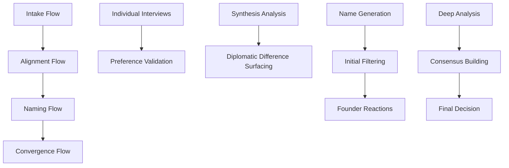

# Onomate - AI-Powered Startup Naming Assistant

> **A sophisticated multi-agent system that facilitates neutral naming conversations between co-founders, acting as part naming expert, part couples therapist.**


Onomate transforms the challenging process of naming a startup from a potential source of founder conflict into a structured, diplomatic, and ultimately successful collaboration.

## 🎯 Mission

Help co-founders navigate the complex emotional and practical landscape of startup naming through:
- **Neutral Facilitation**: Acting as an impartial third party
- **Structured Process**: Breaking down naming into manageable phases  
- **Conflict Resolution**: Surfacing differences constructively
- **Expert Guidance**: Providing naming expertise and feasibility analysis
- **Consensus Building**: Guiding founders toward enthusiastic agreement

## 🏗️ Architecture

Onomate is built on **Skybridge**, a multi-agent orchestration framework that enables sophisticated AI conversations between specialized agents.

### Agent System

| Agent | Role | Expertise |
|-------|------|-----------|
| **Interviewer** | Individual preference extraction | Psychology, market research |
| **Synthesizer** | Finding common ground | Diplomacy, pattern analysis |
| **Namer** | Creative name generation | Linguistics, branding, creativity |
| **Critic** | Feasibility analysis | Legal, domains, risk assessment |
| **Facilitator** | Conversation management | Group dynamics, conflict resolution |

### Workflow Orchestration



## 🚀 Getting Started

### Prerequisites

- Node.js 18+ 
- TypeScript 4.5+
- Skybridge framework
- API keys for domain/trademark checking services

### Installation

```bash
# Clone the repository
git clone https://github.com/yourorg/onomate.git
cd onomate

# Install dependencies
npm install

# Configure environment variables
cp .env.example .env
# Edit .env with your API keys

# added 
npx tsc --init

# Build the project
npm run build

# Start the API server
npm run start:api

# Start the UI development server
npm run start:ui
```

### Configuration

Create a `.env` file with:

```env
# API Keys
OPENAI_API_KEY=your_openai_key
NAMECHEAP_API_KEY=your_namecheap_key
USPTO_API_KEY=your_uspto_key

# Server Configuration  
API_PORT=3001
UI_PORT=3000
NODE_ENV=development

# Memory Configuration
MEMORY_STORAGE=file
MEMORY_PATH=./memory

# Agent Configuration
DEFAULT_MODEL=gpt-4
AGENT_TIMEOUT=30000
```

## 🎭 How It Works

### Phase 1: Individual Interviews (20-30 minutes)

The **Interviewer** agent conducts separate interviews with each founder to extract:

- **Business Context**: Industry, target audience, geographic scope
- **Naming Philosophy**: Preferred styles, tones, inspirations  
- **Practical Constraints**: Domain requirements, legal risk tolerance
- **Personal Preferences**: Deal-breakers, emotional goals

*Example Questions:*
> "What are 3 company names you really admire? What do you like about them?"
> 
> "Should your name be obvious about what you do, or more mysterious?"

### Phase 2: Alignment Discovery (15-25 minutes)

The **Synthesizer** agent analyzes both profiles to:

- **Identify Commonalities**: Shared values and constraints
- **Surface Differences**: Areas requiring navigation  
- **Suggest Compromises**: Creative bridges between perspectives
- **Set Direction**: Strategic approach for name generation

*The Facilitator diplomatically presents findings:*
> "You both clearly value building trust with enterprise customers, though you see different paths to that goal..."

### Phase 3: Name Generation & Filtering (30-45 minutes)

**Namer** and **Critic** agents collaborate to:

- **Generate Candidates**: Using multiple linguistic approaches
- **Assess Feasibility**: Domain availability, trademark risks
- **Gather Reactions**: Structured founder feedback  
- **Iterate Rapidly**: Refine based on preferences

*Name categories explored:*
- Descriptive (FreshBooks, MailChimp)
- Abstract (Stripe, Slack)  
- Compound (AirBnB, FaceBook)
- Metaphorical (Catalyst, Bridge)
- Coined (Kodak, Xerox)

### Phase 4: Consensus & Decision (20-35 minutes)

The **Facilitator** guides final decision-making through:

- **Deep Evaluation**: Comprehensive analysis of top candidates
- **Structured Discussion**: Pros/cons analysis for each option
- **Consensus Building**: Addressing remaining concerns
- **Commitment Confirmation**: Ensuring enthusiastic agreement

## 🔧 API Reference

### Session Management

```typescript
// Create a new naming session
POST /session
{
  "founders": ["founder_a", "founder_b"]
}

// Get session status  
GET /session/:sessionId

// Update session state
PUT /session/:sessionId
```

### Founder Profiles

```typescript
// Create founder profile
POST /founders
{
  "founderId": "founder_a",
  "profile": { /* preference data */ }
}

// Get founder profile
GET /founders/:founderId

// Update preferences
PUT /founders/:founderId
```

### Name Management

```typescript
// Get name suggestions
GET /names/:sessionId

// Add name suggestions
POST /names/:sessionId
{
  "names": [
    {
      "name": "Catalyst", 
      "category": "metaphorical",
      "rationale": "Implies acceleration...",
      "confidence_score": 85
    }
  ]
}

// Add founder feedback
PUT /names/:sessionId/:nameId/feedback
{
  "founder": "founder_a",
  "reaction": "love",
  "comments": "Perfect for our vision!"
}
```

### Agent Invocation

```typescript
// Invoke specific agent
POST /agents/:agentName/invoke
{
  "action": "generate_names",
  "inputs": { /* context data */ },
  "context": { /* additional parameters */ }
}
```

## 🎨 UI Components

### Chat Interface

The main interaction happens through a dual-founder chat interface:

- **Founder Switching**: Toggle between founder perspectives
- **Message Threading**: Organized conversation flow
- **Name Gallery**: Visual presentation of suggestions
- **Reaction System**: Structured feedback collection
- **Progress Tracking**: Clear session advancement

### Key Features

- **Real-time Updates**: Live session state synchronization
- **Mobile Responsive**: Works on tablets and phones
- **Accessibility**: WCAG 2.1 AA compliant
- **Dark Mode**: Eye-friendly extended sessions

## 📊 Memory System

Onomate maintains structured memory across the session:

### Founder Profiles (`founder_a.json`, `founder_b.json`)

```json
{
  "founder_id": "founder_a",
  "profile": {
    "business_context": { /* industry, audience, scope */ },
    "naming_preferences": { /* style, tone, length */ },
    "practical_constraints": { /* domains, legal, budget */ },
    "personal_preferences": { /* deal-breakers, emotions */ }
  },
  "confidence_levels": { /* certainty about each preference */ }
}
```

### Shared Constraints (`shared.json`)

```json
{
  "alignment_analysis": {
    "overall_score": 75,
    "conflict_areas": [ /* areas requiring navigation */ ],
    "synergy_opportunities": [ /* complementary strengths */ ]
  },
  "naming_direction": {
    "primary_strategy": "metaphorical_premium",
    "creative_constraints": { /* generation guidelines */ }
  }
}
```

### Session State (`session.json`)

```json
{
  "progress_tracking": {
    "current_flow": "naming",
    "completion_percentage": 60
  },
  "conversation_state": {
    "energy_level": "high",
    "tension_level": "low",
    "last_intervention": null
  },
  "naming_journey": {
    "names_generated": [ /* all suggestions */ ],
    "shortlist": [ /* final candidates */ ],
    "final_decision": null
  }
}
```

## 🛠️ Utilities

### Name Analysis

```typescript
import NameFilters from './utils/name_filters';

// Analyze a name across multiple dimensions
const analysis = NameFilters.analyzeName("Catalyst");
/*
{
  name: "Catalyst",
  syllableCount: 3,
  pronunciationDifficulty: 0.2,
  memoryScore: 0.8,
  brandabilityScore: 0.9,
  linguisticRisks: [],
  culturalConcerns: []
}
*/

// Filter names by constraints
const viable = NameFilters.filterByConstraints(names, {
  maxLength: 8,
  forbiddenWords: ["tech", "app"],
  culturalSensitivity: true
});

// Rank names by overall viability
const ranked = NameFilters.rankNames(names);
```

### Domain Checking

```typescript
import DomainChecker from './utils/domain_checks';

const checker = new DomainChecker(process.env.NAMECHEAP_API_KEY);

// Check single domain
const result = await checker.checkDomain("catalyst.com");

// Check multiple TLD variations
const tldResults = await checker.checkTLDVariations("catalyst");

// Find alternatives for unavailable domains
const alternatives = await checker.findAlternatives("catalyst", 5);

// Get pricing information
const pricing = await checker.getDomainPrice("catalyst.com");
```

## 🔐 Security & Privacy

### Data Protection

- **Local Storage**: All session data stored locally by default
- **Encryption**: Sensitive data encrypted at rest
- **Anonymization**: No personally identifiable information required
- **Automatic Cleanup**: Session data purged after configurable timeout

### API Security

- **Authentication**: JWT-based session authentication
- **Rate Limiting**: Prevents abuse of external APIs
- **Input Validation**: Comprehensive request validation
- **Audit Logging**: All agent interactions logged

## 📈 Monitoring & Analytics

### Session Metrics

Track success rates and identify improvement opportunities:

- **Completion Rates**: Percentage of sessions reaching consensus
- **Time to Decision**: Average session duration by flow
- **Founder Satisfaction**: Post-session feedback scores  
- **Name Quality**: Viability scores of selected names

### Agent Performance

Monitor individual agent effectiveness:

- **Response Times**: Agent execution performance
- **Success Rates**: Successful task completion percentages
- **Error Rates**: Failed invocations and recovery patterns
- **User Feedback**: Founder reactions to agent interactions

## 🧪 Testing

### Unit Tests

```bash
# Run all tests
npm test

# Run specific test suites
npm test -- agents
npm test -- utils
npm test -- flows

# Run with coverage
npm run test:coverage
```

### Integration Tests

```bash
# Test full workflow
npm run test:integration

# Test API endpoints
npm run test:api

# Test agent interactions  
npm run test:agents
```

### Manual Testing Scenarios

1. **Harmonious Founders**: Both founders largely aligned
2. **Creative Tension**: Complementary but different styles
3. **High Conflict**: Opposing philosophies requiring mediation
4. **Analysis Paralysis**: Founders stuck in indecision
5. **Domain Challenges**: Preferred names unavailable

## 🚀 Deployment

### Production Setup

```bash
# Build for production
npm run build:prod

# Start production server
npm run start:prod

# Or use PM2 for process management
pm2 start ecosystem.config.js
```

### Docker Deployment

```dockerfile
FROM node:18-alpine
WORKDIR /app
COPY package*.json ./
RUN npm ci --only=production
COPY dist/ ./dist/
EXPOSE 3001
CMD ["npm", "run", "start:prod"]
```

### Environment Variables

```bash
# Production configuration
NODE_ENV=production
API_PORT=3001
MEMORY_STORAGE=redis
REDIS_URL=redis://localhost:6379

# External services
OPENAI_API_KEY=your_production_key
DOMAIN_CHECK_PROVIDER=namecheap
TRADEMARK_CHECK_PROVIDER=uspto

# Monitoring
SENTRY_DSN=your_sentry_dsn
ANALYTICS_PROVIDER=mixpanel
```

## 📝 Contributing

We welcome contributions! See [CONTRIBUTING.md](CONTRIBUTING.md) for guidelines.

### Development Setup

```bash
# Fork and clone the repo
git clone https://github.com/yourusername/onomate.git

# Install dependencies
npm install

# Start development servers
npm run dev

# Run tests
npm test

# Submit a pull request
```

### Code Style

- TypeScript with strict mode
- ESLint + Prettier for formatting
- Comprehensive JSDoc comments
- 80%+ test coverage requirement

## 🐛 Troubleshooting

### Common Issues

**Agent timeouts**
```bash
# Increase timeout in skybridge.yaml
agents:
  - name: "namer"
    timeout: 60000  # 60 seconds
```

**Memory persistence errors**
```bash
# Check file permissions
chmod 755 ./memory/
chown -R $USER:$USER ./memory/
```

**API rate limiting**
```bash
# Adjust rate limits in config
api:
  rate_limit:
    window_ms: 60000
    max_requests: 100
```

### Debug Mode

```bash
# Enable debug logging
DEBUG=onomate:* npm start

# Agent-specific debugging  
DEBUG=onomate:agents:namer npm start

# Memory debugging
DEBUG=onomate:memory npm start
```

## 📚 Additional Resources

- [Skybridge Documentation](https://skybridge.dev/docs)
- [Naming Best Practices Guide](docs/naming-guide.md)  
- [Agent Development Guide](docs/agent-development.md)
- [API Documentation](docs/api.md)
- [Deployment Guide](docs/deployment.md)

## 📄 License

MIT License - see [LICENSE](LICENSE) file for details.

## 🙏 Acknowledgments

- **Skybridge Framework**: Multi-agent orchestration platform
- **OpenAI**: GPT models for agent intelligence
- **Naming Research**: Academic research on brand naming
- **Community**: Beta testers and feedback providers

---

**Built with ❤️ for founders who believe great names matter**

*Onomate - Because every startup deserves a name both founders love*